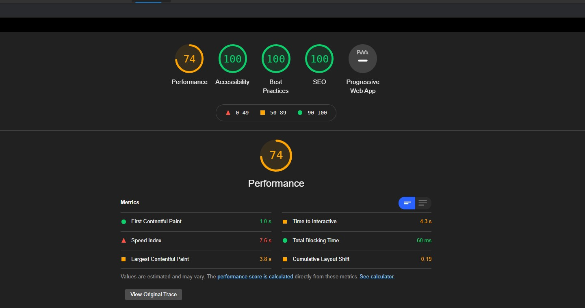

# [Mission Space X](https://mission-space-x.herokuapp.com/) 
Application which would help users list and browse all launches by SpaceX program, check out the live site [here](https://mission-space-x.herokuapp.com/)

## Light house score


## Technologies used
- React JS with Typescripting
- Jest (Testing library) for unit testing
- Node JS express for backend
- SCSS for CSS

## Local Setup
```
// local development env
npm install

// start unit test cases in watch mode
npm run test::watch

// bundle express server in watch mode
npm run build::server

// serve the file over localhost:8080 on watch mode
npm run ds

// bundle front end file
npm run build::watch
```